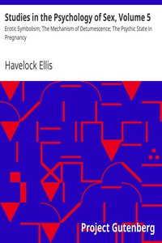

# Studies in the Psychology of Sex, Volume 5: Erotic Symbolism; The Mechanism of Detumescence; The Psychic State in Pregnancy <kbd>13614</kbd>

## Authors

 - Ellis, Havelock <small>(1859 - 1939)</small>

## Subjects

 - Sex
 - Sex (Psychology)

## Download

 - https://www.gutenberg.org/files/13614/13614-h.zip
 - https://www.gutenberg.org/files/13614/13614-8.txt
 - https://www.gutenberg.org/cache/epub/13614/pg13614.cover.medium.jpg
 - https://www.gutenberg.org/files/13614/13614-h/13614-h.htm
 - https://www.gutenberg.org/files/13614/13614.txt
 - https://www.gutenberg.org/ebooks/13614.html.images
 - https://www.gutenberg.org/ebooks/13614.txt.utf-8
 - https://www.gutenberg.org/ebooks/13614.epub.images
 - https://www.gutenberg.org/ebooks/13614.rdf
 - https://www.gutenberg.org/ebooks/13614.kindle.images

## Book Shelves

 - Banned Books from Anne Haight's list
 - Psychology
