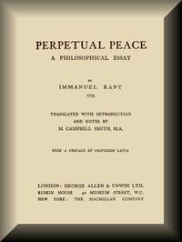

# Perpetual Peace: A Philosophical Essay <kbd>50922</kbd>

## Authors

 - Kant, Immanuel <small>(1724 - 1804)</small>

## Subjects

 - Peace

## Download

 - https://www.gutenberg.org/cache/epub/50922/pg50922.cover.small.jpg
 - https://www.gutenberg.org/files/50922/50922-h.zip
 - https://www.gutenberg.org/files/50922/50922-0.txt
 - https://www.gutenberg.org/ebooks/50922.html.images
 - https://www.gutenberg.org/files/50922/50922-h/50922-h.htm
 - https://www.gutenberg.org/ebooks/50922.rdf
 - https://www.gutenberg.org/ebooks/50922.epub.images
 - https://www.gutenberg.org/ebooks/50922.kindle.images

## Book Shelves

