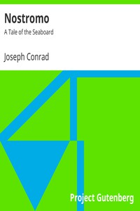

# Nostromo: A Tale of the Seaboard <kbd>2021</kbd>

## Authors

 - Conrad, Joseph <small>(1857 - 1924)</small>

## Subjects

 - Latin America -- Fiction
 - Political fiction
 - Revolutions -- Fiction
 - Sailors -- Fiction
 - Sea stories

## Download

 - https://www.gutenberg.org/files/2021/2021.zip
 - https://www.gutenberg.org/files/2021/2021-h.zip
 - https://www.gutenberg.org/cache/epub/2021/pg2021.cover.small.jpg
 - https://www.gutenberg.org/files/2021/2021-h/2021-h.htm
 - https://www.gutenberg.org/files/2021/2021-0.txt
 - https://www.gutenberg.org/ebooks/2021.html.images
 - https://www.gutenberg.org/ebooks/2021.epub.images
 - https://www.gutenberg.org/ebooks/2021.rdf
 - https://www.gutenberg.org/ebooks/2021.kindle.images

## Book Shelves

 - Best Books Ever Listings
