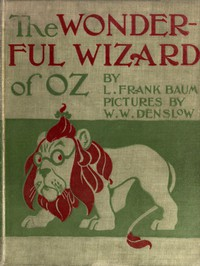

# The Wonderful Wizard of Oz <kbd>55</kbd>

## Authors

 - Baum, L. Frank (Lyman Frank) <small>(1856 - 1919)</small>

## Subjects

 - Courage -- Juvenile fiction
 - Cowardly Lion (Fictitious character) -- Juvenile fiction
 - Cyclones -- Juvenile fiction
 - Dreams -- Juvenile fiction
 - Fantasy literature
 - Gale, Dorothy (Fictitious character) -- Juvenile fiction
 - Good and evil -- Juvenile fiction
 - Home -- Juvenile fiction
 - Oz (Imaginary place) -- Juvenile fiction
 - Scarecrow (Fictitious character from Baum) -- Juvenile fiction
 - Tin Woodman (Fictitious character) -- Juvenile fiction
 - Toto (Fictitious character) -- Juvenile fiction
 - Witches -- Juvenile fiction
 - Wizard of Oz (Fictitious character) -- Juvenile fiction

## Download

 - https://www.gutenberg.org/cache/epub/55/pg55.cover.small.jpg
 - https://www.gutenberg.org/files/55/55-h/55-h.htm
 - https://www.gutenberg.org/ebooks/55.html.images
 - https://www.gutenberg.org/files/55/55-0.zip
 - https://www.gutenberg.org/files/55/55-0.txt
 - https://www.gutenberg.org/ebooks/55.kindle.images
 - https://www.gutenberg.org/ebooks/55.rdf
 - https://www.gutenberg.org/ebooks/55.epub.images

## Book Shelves

 - Children's Literature
 - Fantasy
