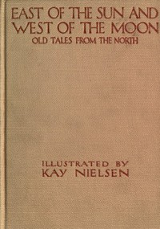

# East of the Sun and West of the Moon: Old Tales from the North <kbd>30973</kbd>

## Authors

 - Moe, Jørgen Engebretsen <small>(1813 - 1882)</small>
 - Asbjørnsen, Peter Christen <small>(1812 - 1885)</small>

## Subjects

 - Fairy tales -- Norway
 - Folklore -- Norway
 - Tales -- Norway

## Download

 - https://www.gutenberg.org/files/30973/30973.zip
 - https://www.gutenberg.org/files/30973/30973-8.zip
 - https://www.gutenberg.org/cache/epub/30973/pg30973.cover.medium.jpg
 - https://www.gutenberg.org/files/30973/30973-h/30973-h.htm
 - https://www.gutenberg.org/ebooks/30973.html.images
 - https://www.gutenberg.org/files/30973/30973.txt
 - https://www.gutenberg.org/ebooks/30973.txt.utf-8
 - https://www.gutenberg.org/ebooks/30973.epub.images
 - https://www.gutenberg.org/ebooks/30973.rdf
 - https://www.gutenberg.org/ebooks/30973.kindle.images

## Book Shelves

