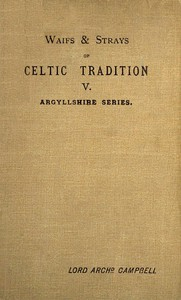

# Clan Traditions and Popular Tales of the Western Highlands and Islands <kbd>67609</kbd>

## Authors

## Subjects

 - Civilization, Celtic
 - Clans -- Scotland -- Highlands
 - Folklore -- Scotland -- Highlands
 - Highlands (Scotland)
 - Oral tradition -- Scotland -- Highlands

## Download

 - https://www.gutenberg.org/ebooks/67609.kindle.images
 - https://www.gutenberg.org/ebooks/67609.txt.utf-8
 - https://www.gutenberg.org/cache/epub/67609/pg67609.cover.medium.jpg
 - https://www.gutenberg.org/ebooks/67609.rdf
 - https://www.gutenberg.org/ebooks/67609.html.images
 - https://www.gutenberg.org/ebooks/67609.epub.images
 - https://www.gutenberg.org/files/67609/67609-0.zip
 - https://www.gutenberg.org/files/67609/67609-0.txt
 - https://www.gutenberg.org/files/67609/67609-h.zip

## Book Shelves

