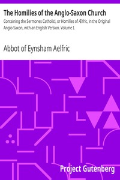

# The Homilies of the Anglo-Saxon Church: Containing the Sermones Catholici, or Homilies of Ælfric, in the Original Anglo-Saxon, with an English Version. Volume I. <kbd>38334</kbd>

## Authors

 - Aelfric, Abbot of Eynsham <small>(950 - 1019)</small>

## Subjects

 - Sermons, English (Old)

## Download

 - https://www.gutenberg.org/cache/epub/38334/pg38334.cover.small.jpg
 - https://www.gutenberg.org/files/38334/38334.txt
 - https://www.gutenberg.org/files/38334/38334-0.txt
 - https://www.gutenberg.org/ebooks/38334.html.images
 - https://www.gutenberg.org/files/38334/38334-8.txt
 - https://www.gutenberg.org/files/38334/38334-h/38334-h.htm
 - https://www.gutenberg.org/ebooks/38334.rdf
 - https://www.gutenberg.org/ebooks/38334.kindle.images
 - https://www.gutenberg.org/ebooks/38334.epub.images

## Book Shelves

