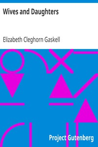

# Wives and Daughters <kbd>4274</kbd>

## Authors

 - Gaskell, Elizabeth Cleghorn <small>(1810 - 1865)</small>

## Subjects

 - Bildungsromans
 - Children of physicians -- Fiction
 - Domestic fiction
 - England -- Fiction
 - Fathers and daughters -- Fiction
 - Love stories
 - Social classes -- Fiction
 - Stepfamilies -- Fiction
 - Young women -- Fiction

## Download

 - https://www.gutenberg.org/cache/epub/4274/pg4274.cover.medium.jpg
 - https://www.gutenberg.org/files/4274/4274-8.zip
 - https://www.gutenberg.org/files/4274/4274.zip
 - https://www.gutenberg.org/files/4274/4274-h.zip
 - https://www.gutenberg.org/files/4274/4274-8.txt
 - https://www.gutenberg.org/ebooks/4274.html.images
 - https://www.gutenberg.org/ebooks/4274.txt.utf-8
 - https://www.gutenberg.org/ebooks/4274.kindle.images
 - https://www.gutenberg.org/ebooks/4274.epub.images
 - https://www.gutenberg.org/ebooks/4274.rdf

## Book Shelves

