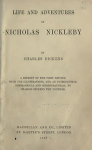

# Nicholas Nickleby <kbd>967</kbd>

## Authors

 - Dickens, Charles <small>(1812 - 1870)</small>

## Subjects

 - Bildungsromans
 - Boarding schools -- Fiction
 - England -- Fiction
 - England -- Social life and customs -- 19th century -- Fiction
 - Picaresque literature
 - Poor families -- Fiction
 - Theatrical companies -- Fiction
 - Young men -- Fiction

## Download

 - https://www.gutenberg.org/files/967/967-h.zip
 - https://www.gutenberg.org/files/967/967.txt
 - https://www.gutenberg.org/files/967/967-0.zip
 - https://www.gutenberg.org/cache/epub/967/pg967.cover.medium.jpg
 - https://www.gutenberg.org/ebooks/967.html.images
 - https://www.gutenberg.org/files/967/967-0.txt
 - https://www.gutenberg.org/ebooks/967.kindle.images
 - https://www.gutenberg.org/ebooks/967.rdf
 - https://www.gutenberg.org/ebooks/967.epub.images

## Book Shelves

