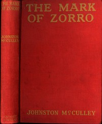

# The Mark of Zorro <kbd>61620</kbd>

## Authors

 - McCulley, Johnston <small>(1883 - 1958)</small>

## Subjects

 - Aristocracy (Social class) -- Fiction
 - California -- Fiction
 - Spaniards -- California -- Fiction
 - Vigilantes -- Fiction
 - Western stories
 - Zorro (Fictitious character) -- Fiction

## Download

 - https://www.gutenberg.org/cache/epub/61620/pg61620.cover.small.jpg
 - https://www.gutenberg.org/files/61620/61620-h.zip
 - https://www.gutenberg.org/files/61620/61620-h/61620-h.htm
 - https://www.gutenberg.org/files/61620/61620-8.txt
 - https://www.gutenberg.org/ebooks/61620.html.images
 - https://www.gutenberg.org/ebooks/61620.txt.utf-8
 - https://www.gutenberg.org/ebooks/61620.rdf
 - https://www.gutenberg.org/ebooks/61620.kindle.images
 - https://www.gutenberg.org/ebooks/61620.epub.images

## Book Shelves

