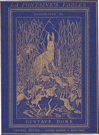

# The Fables of La Fontaine: Translated into English Verse by Walter Thornbury and Illustrated by Gustave Doré <kbd>50316</kbd>

## Authors

 - La Fontaine, Jean de <small>(1621 - 1695)</small>

## Subjects

 - Fables, French -- Translations into English

## Download

 - https://www.gutenberg.org/cache/epub/50316/pg50316.cover.small.jpg
 - https://www.gutenberg.org/files/50316/50316-0.zip
 - https://www.gutenberg.org/files/50316/50316-h.zip
 - https://www.gutenberg.org/files/50316/50316-0.txt
 - https://www.gutenberg.org/ebooks/50316.html.images
 - https://www.gutenberg.org/ebooks/50316.rdf
 - https://www.gutenberg.org/ebooks/50316.epub.images
 - https://www.gutenberg.org/ebooks/50316.kindle.images

## Book Shelves

