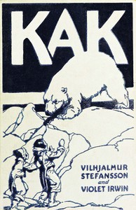

# Kak, the Copper Eskimo <kbd>67630</kbd>

## Authors

 - Stefansson, Vilhjalmur <small>(1879 - 1962)</small>
 - Irwin, Violet <small>(1881 - null)</small>

## Subjects

 - Arctic regions -- Juvenile fiction
 - Copper Inuit boys -- Juvenile fiction
 - Victoria Island (Nunavut and N.W.T.) -- Juvenile fiction

## Download

 - https://www.gutenberg.org/ebooks/67630.rdf
 - https://www.gutenberg.org/files/67630/67630-h.zip
 - https://www.gutenberg.org/files/67630/67630-0.zip
 - https://www.gutenberg.org/ebooks/67630.epub.images
 - https://www.gutenberg.org/cache/epub/67630/pg67630.cover.small.jpg
 - https://www.gutenberg.org/ebooks/67630.txt.utf-8
 - https://www.gutenberg.org/ebooks/67630.kindle.images
 - https://www.gutenberg.org/files/67630/67630-0.txt
 - https://www.gutenberg.org/files/67630/67630-h/67630-h.htm

## Book Shelves

