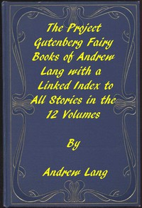

# The Fairy Books of Andrew Lang: A Project Gutenberg Linked Index to All Stories in the 12 Volumes <kbd>30580</kbd>

## Authors

 - Lang, Andrew <small>(1844 - 1912)</small>

## Subjects

 - Fairy tales
 - Folklore

## Download

 - https://www.gutenberg.org/files/30580/30580-8.zip
 - https://www.gutenberg.org/files/30580/30580.zip
 - https://www.gutenberg.org/cache/epub/30580/pg30580.cover.small.jpg
 - https://www.gutenberg.org/ebooks/30580.html.images
 - https://www.gutenberg.org/ebooks/30580.txt.utf-8
 - https://www.gutenberg.org/ebooks/30580.epub.images
 - https://www.gutenberg.org/ebooks/30580.rdf
 - https://www.gutenberg.org/files/30580/30580-h/30580-h.htm
 - https://www.gutenberg.org/ebooks/30580.kindle.images

## Book Shelves

