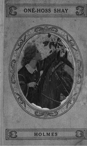

# The Wonderful "One-Hoss-Shay", and Other Poems <kbd>45280</kbd>

## Authors

 - Holmes, Oliver Wendell <small>(1809 - 1894)</small>

## Subjects

 - American poetry -- 19th century

## Download

 - https://www.gutenberg.org/files/45280/45280-h.zip
 - https://www.gutenberg.org/files/45280/45280-0.txt
 - https://www.gutenberg.org/cache/epub/45280/pg45280.cover.medium.jpg
 - https://www.gutenberg.org/files/45280/45280-h/45280-h.htm
 - https://www.gutenberg.org/files/45280/45280.txt
 - https://www.gutenberg.org/ebooks/45280.html.images
 - https://www.gutenberg.org/ebooks/45280.kindle.images
 - https://www.gutenberg.org/ebooks/45280.rdf
 - https://www.gutenberg.org/ebooks/45280.epub.images

## Book Shelves

