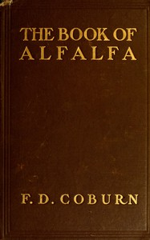

# The Book of Alfalfa: History, Cultivation and Merits: Its Uses as a Forage and Fertilizer <kbd>67533</kbd>

## Authors

 - Coburn, F. D. (Foster Dwight) <small>(1846 - 1924)</small>

## Subjects

 - Alfalfa

## Download

 - https://www.gutenberg.org/ebooks/67533.rdf
 - https://www.gutenberg.org/ebooks/67533.kindle.images
 - https://www.gutenberg.org/files/67533/67533-0.zip
 - https://www.gutenberg.org/ebooks/67533.epub.images
 - https://www.gutenberg.org/ebooks/67533.txt.utf-8
 - https://www.gutenberg.org/cache/epub/67533/pg67533.cover.small.jpg
 - https://www.gutenberg.org/files/67533/67533-h/67533-h.htm
 - https://www.gutenberg.org/files/67533/67533-0.txt

## Book Shelves

