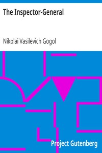

# The Inspector-General <kbd>3735</kbd>

## Authors

 - Gogol, Nikolai Vasilevich <small>(1809 - 1852)</small>

## Subjects

 - Comedies
 - Russia -- Social life and customs -- Drama
 - Russian drama -- Translations into English

## Download

 - https://www.gutenberg.org/files/3735/3735-8.zip
 - https://www.gutenberg.org/files/3735/3735.zip
 - https://www.gutenberg.org/files/3735/3735-h/3735-h.htm
 - https://www.gutenberg.org/ebooks/3735.html.images
 - https://www.gutenberg.org/cache/epub/3735/pg3735.cover.medium.jpg
 - https://www.gutenberg.org/files/3735/3735-8.txt
 - https://www.gutenberg.org/ebooks/3735.kindle.images
 - https://www.gutenberg.org/ebooks/3735.epub.images
 - https://www.gutenberg.org/ebooks/3735.rdf
 - https://www.gutenberg.org/ebooks/3735.txt.utf-8

## Book Shelves

