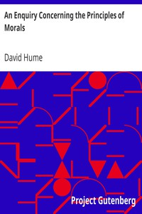

# An Enquiry Concerning the Principles of Morals <kbd>4320</kbd>

## Authors

 - Hume, David <small>(1711 - 1776)</small>

## Subjects

 - Conduct of life
 - Ethics

## Download

 - https://www.gutenberg.org/files/4320/4320.zip
 - https://www.gutenberg.org/cache/epub/4320/pg4320.cover.medium.jpg
 - https://www.gutenberg.org/files/4320/4320.txt
 - https://www.gutenberg.org/ebooks/4320.html.images
 - https://www.gutenberg.org/files/4320/4320-h/4320-h.htm
 - https://www.gutenberg.org/ebooks/4320.txt.utf-8
 - https://www.gutenberg.org/ebooks/4320.kindle.images
 - https://www.gutenberg.org/ebooks/4320.rdf
 - https://www.gutenberg.org/ebooks/4320.epub.images

## Book Shelves

 - Philosophy
