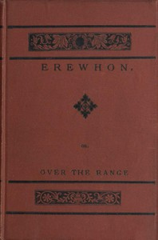

# Erewhon; Or, Over the Range <kbd>1906</kbd>

## Authors

 - Butler, Samuel <small>(1835 - 1902)</small>

## Subjects

 - Satire
 - Utopian fiction
 - Utopias -- Fiction

## Download

 - https://www.gutenberg.org/files/1906/1906.txt
 - https://www.gutenberg.org/files/1906/1906-0.txt
 - https://www.gutenberg.org/cache/epub/1906/pg1906.cover.small.jpg
 - https://www.gutenberg.org/files/1906/1906-h.zip
 - https://www.gutenberg.org/ebooks/1906.html.images
 - https://www.gutenberg.org/ebooks/1906.kindle.images
 - https://www.gutenberg.org/ebooks/1906.rdf
 - https://www.gutenberg.org/ebooks/1906.epub.images

## Book Shelves

 - Best Books Ever Listings
 - New Zealand
