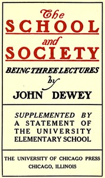

# The School and Society: Being three lectures <kbd>53910</kbd>

## Authors

 - Dewey, John <small>(1859 - 1952)</small>

## Subjects

 - Education
 - Education -- Philosophy
 - Educational psychology
 - University of Chicago. University Elementary School

## Download

 - https://www.gutenberg.org/files/53910/53910-0.zip
 - https://www.gutenberg.org/cache/epub/53910/pg53910.cover.medium.jpg
 - https://www.gutenberg.org/files/53910/53910-h/53910-h.htm
 - https://www.gutenberg.org/ebooks/53910.html.images
 - https://www.gutenberg.org/ebooks/53910.rdf
 - https://www.gutenberg.org/ebooks/53910.kindle.images
 - https://www.gutenberg.org/files/53910/53910-0.txt
 - https://www.gutenberg.org/ebooks/53910.epub.images

## Book Shelves

