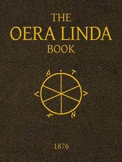

# The Oera Linda Book, from a Manuscript of the Thirteenth Century <kbd>40986</kbd>

## Authors

## Subjects

 - Frisian language -- Texts

## Download

 - https://www.gutenberg.org/files/40986/40986-h.zip
 - https://www.gutenberg.org/files/40986/40986-8.txt
 - https://www.gutenberg.org/files/40986/40986-h/40986-h.htm
 - https://www.gutenberg.org/files/40986/40986.txt
 - https://www.gutenberg.org/cache/epub/40986/pg40986.cover.small.jpg
 - https://www.gutenberg.org/ebooks/40986.html.images
 - https://www.gutenberg.org/ebooks/40986.rdf
 - https://www.gutenberg.org/ebooks/40986.txt.utf-8
 - https://www.gutenberg.org/ebooks/40986.kindle.images
 - https://www.gutenberg.org/ebooks/40986.epub.images

## Book Shelves

