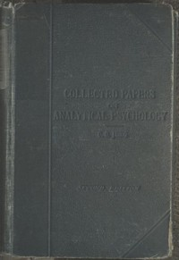

# Collected Papers on Analytical Psychology <kbd>48225</kbd>

## Authors

 - Jung, C. G. (Carl Gustav) <small>(1875 - 1961)</small>

## Subjects

 - Psychoanalysis

## Download

 - https://www.gutenberg.org/files/48225/48225-0.txt
 - https://www.gutenberg.org/cache/epub/48225/pg48225.cover.medium.jpg
 - https://www.gutenberg.org/files/48225/48225-0.zip
 - https://www.gutenberg.org/files/48225/48225-h.zip
 - https://www.gutenberg.org/ebooks/48225.html.images
 - https://www.gutenberg.org/ebooks/48225.epub.images
 - https://www.gutenberg.org/ebooks/48225.rdf
 - https://www.gutenberg.org/ebooks/48225.kindle.images

## Book Shelves

