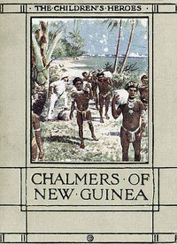

# The Story of Chalmers of New Guinea <kbd>67613</kbd>

## Authors

 - Kelman, Janet Harvey <small>(null - null)</small>

## Subjects

 - Chalmers, James, 1841-1901 -- Juvenile literature
 - Islands -- Juvenile literature
 - Missionaries -- Scotland -- Biography -- Juvenile literature
 - New Guinea -- Juvenile literature
 - Sailing -- Juvenile literature
 - Shipwrecks -- Juvenile literature
 - Voyages and travels -- Juvenile literature

## Download

 - https://www.gutenberg.org/files/67613/67613-0.zip
 - https://www.gutenberg.org/ebooks/67613.rdf
 - https://www.gutenberg.org/cache/epub/67613/pg67613.cover.small.jpg
 - https://www.gutenberg.org/ebooks/67613.txt.utf-8
 - https://www.gutenberg.org/ebooks/67613.epub.images
 - https://www.gutenberg.org/ebooks/67613.kindle.images
 - https://www.gutenberg.org/files/67613/67613-h/67613-h.htm
 - https://www.gutenberg.org/files/67613/67613-0.txt
 - https://www.gutenberg.org/files/67613/67613-h.zip

## Book Shelves

