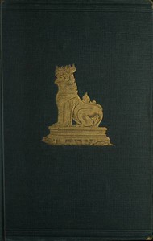

# The Pacification of Burma <kbd>45915</kbd>

## Authors

 - Crosthwaite, C. H. T. (Charles Haukes Todd) <small>(1835 - 1915)</small>

## Subjects

 - Burma -- History -- 1824-1948

## Download

 - https://www.gutenberg.org/files/45915/45915-8.txt
 - https://www.gutenberg.org/ebooks/45915.html.images
 - https://www.gutenberg.org/files/45915/45915-8.zip
 - https://www.gutenberg.org/files/45915/45915.txt
 - https://www.gutenberg.org/cache/epub/45915/pg45915.cover.medium.jpg
 - https://www.gutenberg.org/ebooks/45915.kindle.images
 - https://www.gutenberg.org/ebooks/45915.txt.utf-8
 - https://www.gutenberg.org/ebooks/45915.rdf
 - https://www.gutenberg.org/ebooks/45915.epub.images

## Book Shelves

