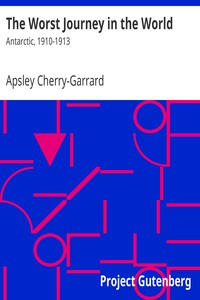

# The Worst Journey in the World: Antarctic, 1910-1913 <kbd>14363</kbd>

## Authors

 - Cherry-Garrard, Apsley <small>(1886 - 1959)</small>

## Subjects

 - Antarctica -- Discovery and exploration -- British
 - British Antarctic ("Terra Nova") Expedition (1910-1913)
 - Cherry-Garrard, Apsley, 1886-1959 -- Travel -- Antarctica
 - Scott, Robert Falcon, 1868-1912 -- Travel -- Antarctica

## Download

 - https://www.gutenberg.org/files/14363/14363-0.zip
 - https://www.gutenberg.org/cache/epub/14363/pg14363.cover.medium.jpg
 - https://www.gutenberg.org/files/14363/14363-0.txt
 - https://www.gutenberg.org/files/14363/14363-h.zip
 - https://www.gutenberg.org/files/14363/14363-h/14363-h.htm
 - https://www.gutenberg.org/ebooks/14363.txt.utf-8
 - https://www.gutenberg.org/ebooks/14363.epub.images
 - https://www.gutenberg.org/ebooks/14363.rdf
 - https://www.gutenberg.org/ebooks/14363.kindle.images

## Book Shelves

