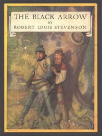

# The Black Arrow: A Tale of the Two Roses <kbd>32954</kbd>

## Authors

 - Stevenson, Robert Louis <small>(1850 - 1894)</small>

## Subjects

 - Bildungsromans
 - Great Britain -- History -- Wars of the Roses, 1455-1485 -- Fiction
 - Guardian and ward -- Fiction
 - Historical fiction
 - Knights and knighthood -- Fiction
 - Outlaws -- Fiction
 - War stories
 - Young men -- Fiction

## Download

 - https://www.gutenberg.org/files/32954/32954-h.zip
 - https://www.gutenberg.org/files/32954/32954-8.txt
 - https://www.gutenberg.org/cache/epub/32954/pg32954.cover.medium.jpg
 - https://www.gutenberg.org/files/32954/32954-h/32954-h.htm
 - https://www.gutenberg.org/ebooks/32954.html.images
 - https://www.gutenberg.org/files/32954/32954.txt
 - https://www.gutenberg.org/ebooks/32954.txt.utf-8
 - https://www.gutenberg.org/ebooks/32954.epub.images
 - https://www.gutenberg.org/ebooks/32954.rdf
 - https://www.gutenberg.org/ebooks/32954.kindle.images

## Book Shelves

