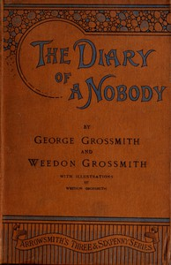

# The Diary of a Nobody <kbd>1026</kbd>

## Authors

 - Grossmith, Weedon <small>(1852 - 1919)</small>
 - Grossmith, George <small>(1847 - 1912)</small>

## Subjects

 - Diary fiction
 - England -- Fiction
 - Humorous stories
 - Men -- England -- Fiction
 - Middle class -- Fiction
 - Suburban life -- Fiction

## Download

 - https://www.gutenberg.org/cache/epub/1026/pg1026.cover.medium.jpg
 - https://www.gutenberg.org/files/1026/1026-0.zip
 - https://www.gutenberg.org/files/1026/1026-h.zip
 - https://www.gutenberg.org/ebooks/1026.html.images
 - https://www.gutenberg.org/ebooks/1026.txt.utf-8
 - https://www.gutenberg.org/files/1026/1026-0.txt
 - https://www.gutenberg.org/ebooks/1026.rdf
 - https://www.gutenberg.org/ebooks/1026.epub.images
 - https://www.gutenberg.org/ebooks/1026.kindle.images

## Book Shelves

 - Best Books Ever Listings
 - Humor
