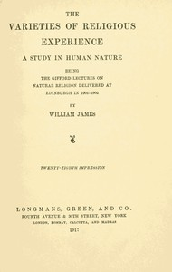

# The Varieties of Religious Experience: A Study in Human Nature <kbd>621</kbd>

## Authors

 - James, William <small>(1842 - 1910)</small>

## Subjects

 - Conversion
 - Experience (Religion)
 - Philosophy and religion
 - Psychology, Religious
 - Religion

## Download

 - https://www.gutenberg.org/files/621/621-pdf.zip
 - https://www.gutenberg.org/files/621/621-8.zip
 - https://www.gutenberg.org/files/621/621-tei.tei
 - https://www.gutenberg.org/files/621/621.zip
 - https://www.gutenberg.org/cache/epub/621/pg621.cover.small.jpg
 - https://www.gutenberg.org/files/621/621-8.txt
 - https://www.gutenberg.org/files/621/621-h/621-h.html
 - https://www.gutenberg.org/ebooks/621.html.images
 - https://www.gutenberg.org/ebooks/621.kindle.images
 - https://www.gutenberg.org/ebooks/621.txt.utf-8
 - https://www.gutenberg.org/files/621/621-pdf.pdf
 - https://www.gutenberg.org/ebooks/621.rdf
 - https://www.gutenberg.org/ebooks/621.epub.images

## Book Shelves

