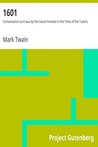

# 1601: Conversation as it was by the Social Fireside in the Time of the Tudors <kbd>3190</kbd>

## Authors

 - Twain, Mark <small>(1835 - 1910)</small>

## Subjects

 - Great Britain -- History -- Elizabeth, 1558-1603 -- Fiction
 - Imaginary conversations
 - Raleigh, Walter, Sir, 1552?-1618 -- Fiction
 - Satire

## Download

 - https://www.gutenberg.org/files/3190/3190-0.zip
 - https://www.gutenberg.org/cache/epub/3190/pg3190.cover.small.jpg
 - https://www.gutenberg.org/files/3190/3190-h.zip
 - https://www.gutenberg.org/files/3190/3190-0.txt
 - https://www.gutenberg.org/ebooks/3190.html.images
 - https://www.gutenberg.org/ebooks/3190.rdf
 - https://www.gutenberg.org/ebooks/3190.epub.images
 - https://www.gutenberg.org/ebooks/3190.kindle.images

## Book Shelves

