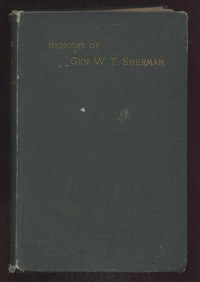

# Memoirs of General William T. Sherman — Complete <kbd>4361</kbd>

## Authors

 - Sherman, William T. (William Tecumseh) <small>(1820 - 1891)</small>

## Subjects

 - Generals -- United States -- Biography
 - Sherman, William T. (William Tecumseh), 1820-1891
 - United States -- History -- Civil War, 1861-1865 -- Campaigns
 - United States -- History -- Civil War, 1861-1865 -- Personal narratives
 - United States. Army -- Biography

## Download

 - https://www.gutenberg.org/cache/epub/4361/pg4361.cover.medium.jpg
 - https://www.gutenberg.org/files/4361/4361.txt
 - https://www.gutenberg.org/files/4361/4361-h/4361-h.htm
 - https://www.gutenberg.org/files/4361/4361-h.zip
 - https://www.gutenberg.org/ebooks/4361.html.images
 - https://www.gutenberg.org/ebooks/4361.txt.utf-8
 - https://www.gutenberg.org/ebooks/4361.kindle.images
 - https://www.gutenberg.org/ebooks/4361.epub.images
 - https://www.gutenberg.org/ebooks/4361.rdf

## Book Shelves

 - US Civil War
