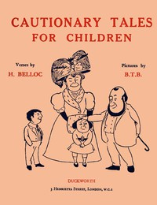

# Cautionary Tales for Children <kbd>27424</kbd>

## Authors

 - Belloc, Hilaire <small>(1870 - 1953)</small>

## Subjects

 - Children's poetry, English
 - Conduct of life -- Juvenile poetry

## Download

 - https://www.gutenberg.org/files/27424/27424.zip
 - https://www.gutenberg.org/cache/epub/27424/pg27424.cover.small.jpg
 - https://www.gutenberg.org/files/27424/27424-h.zip
 - https://www.gutenberg.org/files/27424/27424-h/27424-h.htm
 - https://www.gutenberg.org/ebooks/27424.html.images
 - https://www.gutenberg.org/ebooks/27424.rdf
 - https://www.gutenberg.org/ebooks/27424.kindle.images
 - https://www.gutenberg.org/ebooks/27424.epub.images
 - https://www.gutenberg.org/ebooks/27424.txt.utf-8

## Book Shelves

