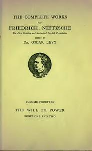

# The Will to Power: An Attempted Transvaluation of All Values. Book I and II <kbd>52914</kbd>

## Authors

 - Nietzsche, Friedrich Wilhelm <small>(1844 - 1900)</small>

## Subjects

 - Nihilism (Philosophy)
 - Power (Philosophy)
 - Values

## Download

 - https://www.gutenberg.org/files/52914/52914-h.zip
 - https://www.gutenberg.org/files/52914/52914-0.zip
 - https://www.gutenberg.org/files/52914/52914-0.txt
 - https://www.gutenberg.org/ebooks/52914.html.images
 - https://www.gutenberg.org/cache/epub/52914/pg52914.cover.small.jpg
 - https://www.gutenberg.org/ebooks/52914.rdf
 - https://www.gutenberg.org/ebooks/52914.kindle.images
 - https://www.gutenberg.org/ebooks/52914.epub.images

## Book Shelves

