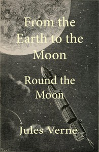

# From the Earth to the Moon; and, Round the Moon <kbd>83</kbd>

## Authors

 - Verne, Jules <small>(1828 - 1905)</small>

## Subjects

 - Manned space flight -- Fiction
 - Moon -- Fiction
 - Science fiction
 - Space flight to the moon -- Fiction
 - Space ships -- Fiction

## Download

 - https://www.gutenberg.org/cache/epub/83/pg83.cover.small.jpg
 - https://www.gutenberg.org/files/83/83-0.zip
 - https://www.gutenberg.org/files/83/83-h/83-h.htm
 - https://www.gutenberg.org/ebooks/83.html.images
 - https://www.gutenberg.org/ebooks/83.kindle.images
 - https://www.gutenberg.org/ebooks/83.rdf
 - https://www.gutenberg.org/ebooks/83.epub.images

## Book Shelves

 - Movie Books
 - Science Fiction
