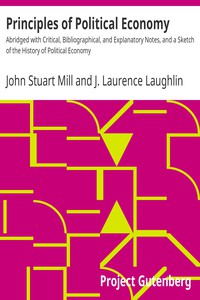

# Principles of Political Economy: Abridged with Critical, Bibliographical, and Explanatory Notes, and a Sketch of the History of Political Economy <kbd>30107</kbd>

## Authors

 - Mill, John Stuart <small>(1806 - 1873)</small>

## Subjects

 - Economics

## Download

 - https://www.gutenberg.org/files/30107/30107-h/30107-h.html
 - https://www.gutenberg.org/files/30107/30107-pdf.zip
 - https://www.gutenberg.org/files/30107/30107.txt
 - https://www.gutenberg.org/files/30107/30107-0.zip
 - https://www.gutenberg.org/files/30107/30107-8.txt
 - https://www.gutenberg.org/cache/epub/30107/pg30107.cover.small.jpg
 - https://www.gutenberg.org/files/30107/30107-pdf.pdf
 - https://www.gutenberg.org/files/30107/30107-tei/30107-tei.tei
 - https://www.gutenberg.org/ebooks/30107.html.images
 - https://www.gutenberg.org/ebooks/30107.epub.images
 - https://www.gutenberg.org/ebooks/30107.rdf
 - https://www.gutenberg.org/ebooks/30107.kindle.images

## Book Shelves

 - Banned Books from Anne Haight's list
