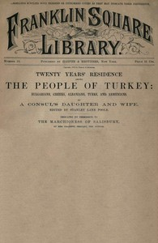

# Twenty Years' Residence among the People of Turkey: Bulgarians, Greeks, Albanians, Turks, and Armenians <kbd>67626</kbd>

## Authors

 - Blunt, Fanny Janet Sandison <small>(1840 - 1926)</small>

## Subjects

 - Balkan Peninsula -- Social life and customs
 - Eastern question (Balkan)
 - Land tenure -- Turkey
 - Turkey -- Population
 - Turkey -- Social life and customs
 - Women -- Education -- Turkey
 - Women -- Turkey

## Download

 - https://www.gutenberg.org/ebooks/67626.rdf
 - https://www.gutenberg.org/ebooks/67626.txt.utf-8
 - https://www.gutenberg.org/cache/epub/67626/pg67626.cover.small.jpg
 - https://www.gutenberg.org/files/67626/67626-0.zip
 - https://www.gutenberg.org/ebooks/67626.epub.images
 - https://www.gutenberg.org/files/67626/67626-h.zip
 - https://www.gutenberg.org/ebooks/67626.kindle.images
 - https://www.gutenberg.org/files/67626/67626-h/67626-h.htm
 - https://www.gutenberg.org/files/67626/67626-0.txt

## Book Shelves

