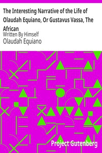

# The Interesting Narrative of the Life of Olaudah Equiano, Or Gustavus Vassa, The African: Written By Himself <kbd>15399</kbd>

## Authors

 - Equiano, Olaudah <small>(1745 - 1797)</small>

## Subjects

 - Equiano, Olaudah, 1745-1797
 - Slaves -- Great Britain -- Biography
 - Slaves -- United States -- Biography

## Download

 - https://www.gutenberg.org/files/15399/15399-h.zip
 - https://www.gutenberg.org/files/15399/15399.zip
 - https://www.gutenberg.org/cache/epub/15399/pg15399.cover.small.jpg
 - https://www.gutenberg.org/files/15399/15399-8.zip
 - https://www.gutenberg.org/ebooks/15399.html.images
 - https://www.gutenberg.org/files/15399/15399-8.txt
 - https://www.gutenberg.org/ebooks/15399.kindle.images
 - https://www.gutenberg.org/ebooks/15399.txt.utf-8
 - https://www.gutenberg.org/ebooks/15399.epub.images
 - https://www.gutenberg.org/ebooks/15399.rdf

## Book Shelves

 - Africa
