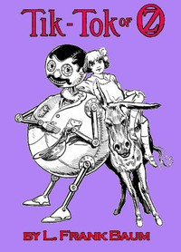

# Tik-Tok of Oz <kbd>52176</kbd>

## Authors

 - Baum, L. Frank (Lyman Frank) <small>(1856 - 1919)</small>

## Subjects

 - Animals, Mythical -- Juvenile fiction
 - Brothers -- Juvenile fiction
 - Dragons -- Juvenile fiction
 - Fantasy literature
 - Gale, Dorothy (Fictitious character) -- Juvenile fiction
 - Girls -- Juvenile fiction
 - Good and evil -- Juvenile fiction
 - Kings and rulers -- Juvenile fiction
 - Magic -- Juvenile fiction
 - Mules -- Juvenile fiction
 - Oz (Imaginary place) -- Juvenile fiction
 - Princess Ozma (Fictitious character) -- Juvenile fiction
 - Voyages and travels -- Juvenile fiction

## Download

 - https://www.gutenberg.org/cache/epub/52176/pg52176.cover.small.jpg
 - https://www.gutenberg.org/files/52176/52176-8.zip
 - https://www.gutenberg.org/files/52176/52176-h.zip
 - https://www.gutenberg.org/files/52176/52176.txt
 - https://www.gutenberg.org/files/52176/52176-8.txt
 - https://www.gutenberg.org/ebooks/52176.kindle.images
 - https://www.gutenberg.org/ebooks/52176.txt.utf-8
 - https://www.gutenberg.org/ebooks/52176.rdf
 - https://www.gutenberg.org/ebooks/52176.epub.images

## Book Shelves

