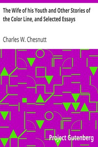

# The Wife of his Youth and Other Stories of the Color Line, and Selected Essays <kbd>11057</kbd>

## Authors

 - Chesnutt, Charles W. (Charles Waddell) <small>(1858 - 1932)</small>

## Subjects

 - African Americans -- Fiction
 - American essays
 - Race awareness -- Fiction
 - Race relations -- Fiction
 - Racially mixed people -- Fiction
 - Racism -- Fiction

## Download

 - https://www.gutenberg.org/cache/epub/11057/pg11057.cover.small.jpg
 - https://www.gutenberg.org/files/11057/11057-8.txt
 - https://www.gutenberg.org/ebooks/11057.txt.utf-8
 - https://www.gutenberg.org/ebooks/11057.epub.images
 - https://www.gutenberg.org/ebooks/11057.html.images
 - https://www.gutenberg.org/ebooks/11057.rdf
 - https://www.gutenberg.org/ebooks/11057.kindle.images
 - https://www.gutenberg.org/files/11057/11057.txt

## Book Shelves

 - African American Writers
