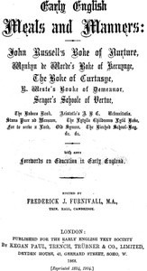

# Early English Meals and Manners <kbd>24790</kbd>

## Authors

## Subjects

 - Education -- Early works to 1800
 - England -- Social life and customs -- Early works to 1800
 - Etiquette
 - Home economics -- Early works to 1800
 - Table

## Download

 - https://www.gutenberg.org/files/24790/24790-0.zip
 - https://www.gutenberg.org/cache/epub/24790/pg24790.cover.medium.jpg
 - https://www.gutenberg.org/files/24790/24790-h/nurture.html
 - https://www.gutenberg.org/files/24790/24790-h/24790-h.htm
 - https://www.gutenberg.org/files/24790/24790-8.zip
 - https://www.gutenberg.org/files/24790/24790-8.txt
 - https://www.gutenberg.org/ebooks/24790.epub.images
 - https://www.gutenberg.org/ebooks/24790.rdf
 - https://www.gutenberg.org/ebooks/24790.kindle.images

## Book Shelves

 - Early English Text Society
 - United Kingdom
