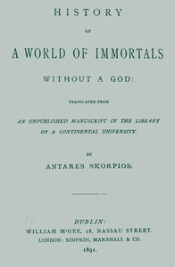

# History of a World of Immortals without a God: Translated from an unpublished manuscript in the library of a continental university <kbd>67548</kbd>

## Authors

## Subjects

 - Science fiction
 - Utopias -- Fiction

## Download

 - https://www.gutenberg.org/files/67548/67548-0.zip
 - https://www.gutenberg.org/ebooks/67548.txt.utf-8
 - https://www.gutenberg.org/ebooks/67548.rdf
 - https://www.gutenberg.org/ebooks/67548.kindle.images
 - https://www.gutenberg.org/ebooks/67548.epub.images
 - https://www.gutenberg.org/ebooks/67548.html.images
 - https://www.gutenberg.org/files/67548/67548-h.zip
 - https://www.gutenberg.org/cache/epub/67548/pg67548.cover.medium.jpg
 - https://www.gutenberg.org/files/67548/67548-0.txt

## Book Shelves

