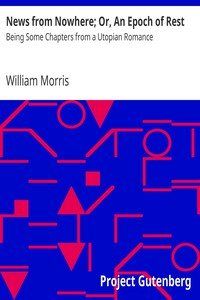

# News from Nowhere; Or, An Epoch of Rest: Being Some Chapters from a Utopian Romance <kbd>3261</kbd>

## Authors

 - Morris, William <small>(1834 - 1896)</small>

## Subjects

 - Utopias

## Download

 - https://www.gutenberg.org/files/3261/3261-h/3261-h.htm
 - https://www.gutenberg.org/files/3261/3261-h.zip
 - https://www.gutenberg.org/cache/epub/3261/pg3261.cover.medium.jpg
 - https://www.gutenberg.org/files/3261/3261.txt
 - https://www.gutenberg.org/ebooks/3261.txt.utf-8
 - https://www.gutenberg.org/ebooks/3261.kindle.images
 - https://www.gutenberg.org/ebooks/3261.epub.images
 - https://www.gutenberg.org/ebooks/3261.rdf

## Book Shelves

 - Fantasy
