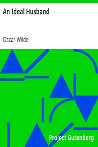

# An Ideal Husband <kbd>885</kbd>

## Authors

 - Wilde, Oscar <small>(1854 - 1900)</small>

## Subjects

 - Comedies
 - London (England) -- Drama

## Download

 - https://www.gutenberg.org/files/885/885-h/885-h.htm
 - https://www.gutenberg.org/files/885/885-h.zip
 - https://www.gutenberg.org/cache/epub/885/pg885.cover.small.jpg
 - https://www.gutenberg.org/files/885/885-0.txt
 - https://www.gutenberg.org/ebooks/885.html.images
 - https://www.gutenberg.org/ebooks/885.kindle.images
 - https://www.gutenberg.org/ebooks/885.rdf
 - https://www.gutenberg.org/ebooks/885.epub.images

## Book Shelves

 - Plays
