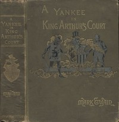

# A Connecticut Yankee in King Arthur's Court <kbd>86</kbd>

## Authors

 - Twain, Mark <small>(1835 - 1910)</small>

## Subjects

 - Americans -- Great Britain -- Fiction
 - Arthurian romances -- Adaptations
 - Britons -- Fiction
 - Fantasy fiction
 - Kings and rulers -- Fiction
 - Knights and knighthood -- Fiction
 - Satire
 - Time travel -- Fiction

## Download

 - https://www.gutenberg.org/files/86/86-0.txt
 - https://www.gutenberg.org/files/86/86-h.zip
 - https://www.gutenberg.org/cache/epub/86/pg86.cover.medium.jpg
 - https://www.gutenberg.org/ebooks/86.html.images
 - https://www.gutenberg.org/ebooks/86.kindle.images
 - https://www.gutenberg.org/ebooks/86.rdf
 - https://www.gutenberg.org/ebooks/86.epub.images

## Book Shelves

 - Arthurian Legends
 - Precursors of Science Fiction
