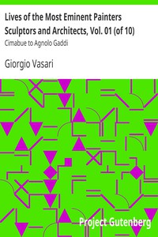

# Lives of the Most Eminent Painters Sculptors and Architects, Vol. 01 (of 10): Cimabue to Agnolo Gaddi <kbd>25326</kbd>

## Authors

 - Vasari, Giorgio <small>(1511 - 1574)</small>

## Subjects

 - Art, Italian
 - Artists -- Italy -- Biography

## Download

 - https://www.gutenberg.org/files/25326/25326.zip
 - https://www.gutenberg.org/cache/epub/25326/pg25326.cover.medium.jpg
 - https://www.gutenberg.org/files/25326/25326-h.zip
 - https://www.gutenberg.org/files/25326/25326-8.zip
 - https://www.gutenberg.org/ebooks/25326.html.images
 - https://www.gutenberg.org/files/25326/25326-8.txt
 - https://www.gutenberg.org/ebooks/25326.kindle.images
 - https://www.gutenberg.org/ebooks/25326.rdf
 - https://www.gutenberg.org/ebooks/25326.epub.images
 - https://www.gutenberg.org/ebooks/25326.txt.utf-8

## Book Shelves

