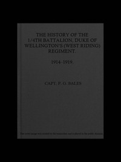

# History of the 1/4th Battalion Duke of Wellington's (West Riding) Regiment, 1914-1919. <kbd>67633</kbd>

## Authors

 - Bales, P. G. <small>(null - null)</small>

## Subjects

 - Great Britain. Army. Duke of Wellington's (West Riding) Regiment
 - World War, 1914-1918 -- Regimental histories -- Great Britain

## Download

 - https://www.gutenberg.org/ebooks/67633.txt.utf-8
 - https://www.gutenberg.org/ebooks/67633.epub.images
 - https://www.gutenberg.org/ebooks/67633.rdf
 - https://www.gutenberg.org/cache/epub/67633/pg67633.cover.small.jpg
 - https://www.gutenberg.org/files/67633/67633-0.zip
 - https://www.gutenberg.org/ebooks/67633.kindle.images
 - https://www.gutenberg.org/files/67633/67633-h.zip
 - https://www.gutenberg.org/files/67633/67633-h/67633-h.htm
 - https://www.gutenberg.org/files/67633/67633-0.txt

## Book Shelves

