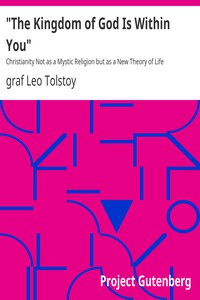

# "The Kingdom of God Is Within You": Christianity Not as a Mystic Religion but as a New Theory of Life <kbd>4602</kbd>

## Authors

 - Tolstoy, Leo, graf <small>(1828 - 1910)</small>

## Subjects

 - Christianity -- Controversial literature
 - Christianity -- Essence, genius, nature
 - Evil, Non-resistance to
 - Government, Resistance to -- Religious aspects -- Christianity
 - Nonviolence -- Religious aspects -- Christianity

## Download

 - https://www.gutenberg.org/files/4602/4602-8.zip
 - https://www.gutenberg.org/files/4602/4602.zip
 - https://www.gutenberg.org/cache/epub/4602/pg4602.cover.small.jpg
 - https://www.gutenberg.org/ebooks/4602.html.images
 - https://www.gutenberg.org/ebooks/4602.txt.utf-8
 - https://www.gutenberg.org/ebooks/4602.kindle.images
 - https://www.gutenberg.org/ebooks/4602.epub.images
 - https://www.gutenberg.org/ebooks/4602.rdf

## Book Shelves

 - Anarchism
