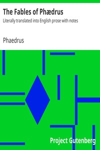

# The Fables of Phædrus: Literally translated into English prose with notes <kbd>25512</kbd>

## Authors

 - Phaedrus <small>(null - null)</small>

## Subjects

 - Fables, Latin -- Translations into English

## Download

 - https://www.gutenberg.org/files/25512/25512-8.txt
 - https://www.gutenberg.org/files/25512/25512-h/25512-h.htm
 - https://www.gutenberg.org/files/25512/25512-8.zip
 - https://www.gutenberg.org/files/25512/25512-0.txt
 - https://www.gutenberg.org/files/25512/25512.zip
 - https://www.gutenberg.org/cache/epub/25512/pg25512.cover.medium.jpg
 - https://www.gutenberg.org/ebooks/25512.html.images
 - https://www.gutenberg.org/ebooks/25512.kindle.images
 - https://www.gutenberg.org/ebooks/25512.rdf
 - https://www.gutenberg.org/ebooks/25512.epub.images

## Book Shelves

