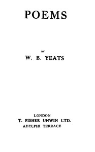

# Poems <kbd>38877</kbd>

## Authors

 - Yeats, W. B. (William Butler) <small>(1865 - 1939)</small>

## Subjects

 - English drama -- Irish authors
 - English poetry -- Irish authors

## Download

 - https://www.gutenberg.org/files/38877/38877-h/38877-h.htm
 - https://www.gutenberg.org/cache/epub/38877/pg38877.cover.medium.jpg
 - https://www.gutenberg.org/files/38877/38877.txt
 - https://www.gutenberg.org/files/38877/38877-8.zip
 - https://www.gutenberg.org/files/38877/38877.zip
 - https://www.gutenberg.org/ebooks/38877.txt.utf-8
 - https://www.gutenberg.org/ebooks/38877.kindle.images
 - https://www.gutenberg.org/ebooks/38877.epub.images
 - https://www.gutenberg.org/ebooks/38877.rdf

## Book Shelves

