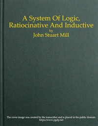

# A System of Logic, Ratiocinative and Inductive <kbd>27942</kbd>

## Authors

 - Mill, John Stuart <small>(1806 - 1873)</small>

## Subjects

 - Knowledge, Theory of
 - Logic
 - Science -- Methodology

## Download

 - https://www.gutenberg.org/files/27942/27942-h.zip
 - https://www.gutenberg.org/ebooks/27942.html.images
 - https://www.gutenberg.org/cache/epub/27942/pg27942.cover.small.jpg
 - https://www.gutenberg.org/files/27942/27942-page-images/p0053.png
 - https://www.gutenberg.org/ebooks/27942.txt.utf-8
 - https://www.gutenberg.org/files/27942/27942-0.txt
 - https://www.gutenberg.org/ebooks/27942.rdf
 - https://www.gutenberg.org/ebooks/27942.epub.images
 - https://www.gutenberg.org/ebooks/27942.kindle.images

## Book Shelves

 - Banned Books from Anne Haight's list
 - Philosophy
