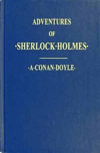

# Adventures of Sherlock Holmes: Illustrated <kbd>48320</kbd>

## Authors

 - Doyle, Arthur Conan <small>(1859 - 1930)</small>

## Subjects

 - Detective and mystery stories, English
 - Holmes, Sherlock (Fictitious character) -- Fiction
 - Private investigators -- England -- Fiction

## Download

 - https://www.gutenberg.org/files/48320/48320-h.zip
 - https://www.gutenberg.org/cache/epub/48320/pg48320.cover.medium.jpg
 - https://www.gutenberg.org/files/48320/48320-0.zip
 - https://www.gutenberg.org/ebooks/48320.html.images
 - https://www.gutenberg.org/files/48320/48320-0.txt
 - https://www.gutenberg.org/ebooks/48320.epub.images
 - https://www.gutenberg.org/ebooks/48320.rdf
 - https://www.gutenberg.org/ebooks/48320.kindle.images

## Book Shelves

