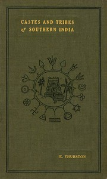

# Castes and Tribes of Southern India. Vol. 1 of 7 <kbd>42991</kbd>

## Authors

 - Thurston, Edgar <small>(1855 - 1935)</small>

## Subjects

 - Caste -- India, South
 - Ethnology -- India, South
 - India, South -- Social life and customs
 - Tribes -- India, South

## Download

 - https://www.gutenberg.org/files/42991/42991.txt
 - https://www.gutenberg.org/files/42991/42991.zip
 - https://www.gutenberg.org/cache/epub/42991/pg42991.cover.small.jpg
 - https://www.gutenberg.org/files/42991/42991-h/42991-h.htm
 - https://www.gutenberg.org/files/42991/42991-8.txt
 - https://www.gutenberg.org/ebooks/42991.html.images
 - https://www.gutenberg.org/ebooks/42991.kindle.images
 - https://www.gutenberg.org/ebooks/42991.rdf
 - https://www.gutenberg.org/ebooks/42991.txt.utf-8
 - https://www.gutenberg.org/ebooks/42991.epub.images

## Book Shelves

